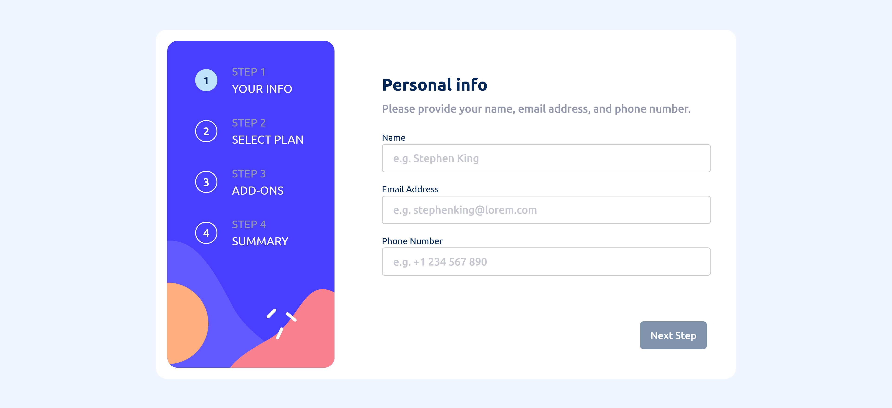
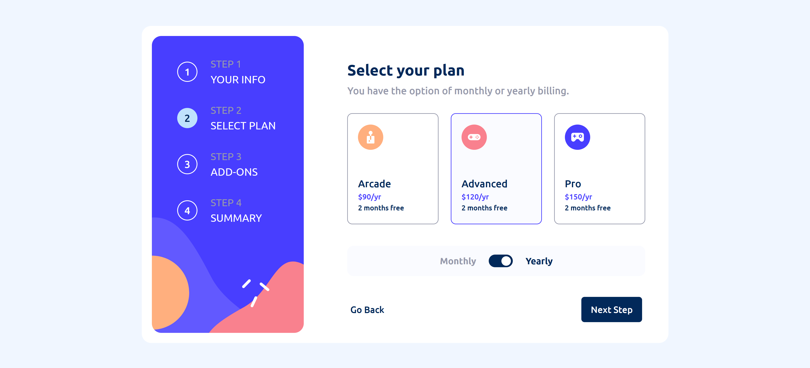

# Frontend Mentor - Multi-step form solution

This is a solution to the [Multi-step form challenge on Frontend Mentor](https://www.frontendmentor.io/challenges/multistep-form-YVAnSdqQBJ). Frontend Mentor challenges help you improve your coding skills by building realistic projects.

## Overview

### The challenge

Users should be able to:

- Complete each step of the sequence
- Go back to a previous step to update their selections
- See a summary of their selections on the final step and confirm their order
- View the optimal layout for the interface depending on their device's screen size
- See hover and focus states for all interactive elements on the page
- Receive form validation messages if:
  - A field has been missed
  - The email address is not formatted correctly
  - A step is submitted, but no selection has been made

### Screenshots

### Links

- Solution URL: [https://github.com/liliaferrouk/multistep-form](https://github.com/liliaferrouk/multistep-form)
- Live Site URL: [https://liliaferrouk.github.io/multistep-form/](https://liliaferrouk.github.io/multistep-form/)

## My process

### Built with

- Semantic HTML5 markup
- CSS (Mobile-first workflow)
- [React](https://reactjs.org/) - JS library

## Author
- Frontend Mentor - [@liliaferrouk](https://www.frontendmentor.io/profile/liliaferrouk)